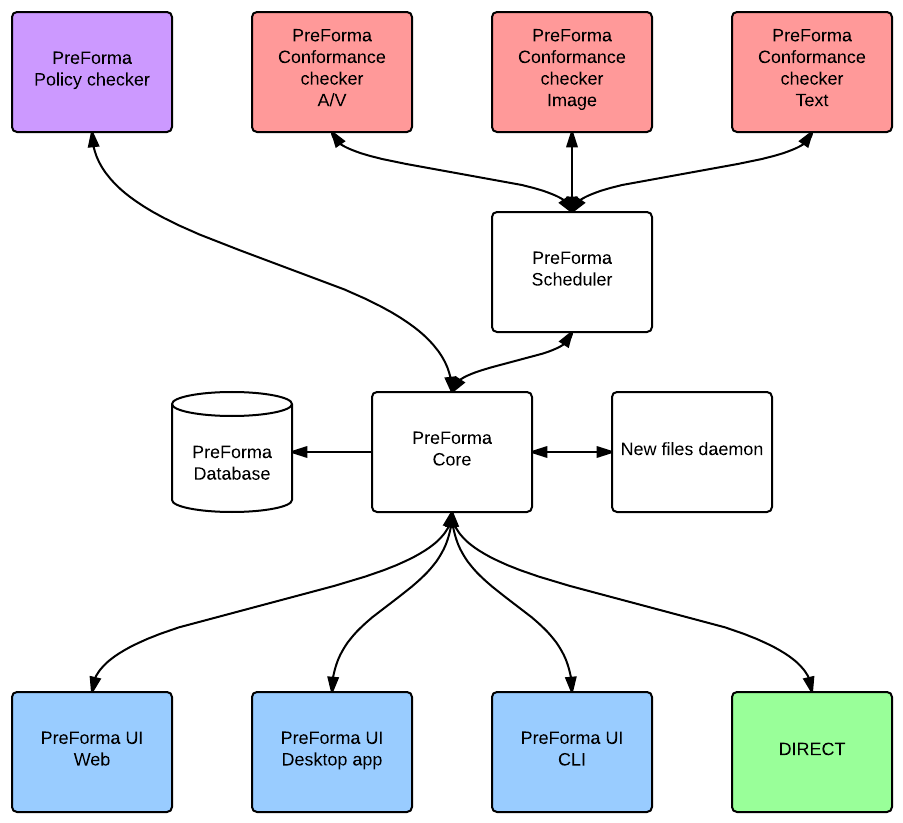

# PreForma Global Architecture

## Architecture schema

## Common to all elements

All elements can be installed on the same server or on different servers, depending on the expected workload.

## Core (Controller)

The Core serves as communication between all plugins within and outside of the PreForma MediaInfo system and between all layers. The Core is the main service and runs in a passive, background mode. 

The Core has several major functions:

* controls the checkers and manages data for the User Interface
* waits for commands from the New Files Daemon and User Interface
* send commands to the scheduler for file-checking
* communicates with the database to store and retrieve data from the checkers
* sends data to DIRECT

The Core supports the following requirements:

- Scheduling
- Statistics
- Reporting
- User management
- Policies management

Interface :

* Scheduler : Advanced Message Queuing Protocol
* Policy checker / User Interface / DIRECT : REST API
* Database : native driver

Programming language : C++

## Database

* store metadata and results of the conformance checker
* store the policy checker rules
* user rights management

Interface :

* Core : native driver

Software :

Potential database management system options, contingent on open source licensing requirements.

* Relational database : MySQL (GPLv2) / PostgreSQL (PostgreSQL License) / SQLite (Public domain)
* Non relational database : MongoDB (AGPLv3) / Elasticsearch (Apache license 2)

## Scheduler

The Scheduler element is a form of software "middleware" that distributes the files to be checked across the conformance checkers by using a message broker interface. It translates the file data into one unified language for access within all aspects of the software.

* distributes files

Interface :

* Core : Advanced Message Queuing Protocol
* Checkers : Advanced Message Queuing Protocol

Software : 

RabbitMQ (MPL 1.1) / Gearman (BSD) / ZeroMQ (LGPL v3)

## New Files Daemon

The New Files Daemon is a background process that listen for new files available for validating. It uses the inotify notification system API for a Linux kernel or kqueue/kevent for a BSD kernel.

Programming language : C++

## Conformance Checker and Metadata Grabbing Module

This module can utilize one or more checkers for each media type.

As the conformance checker process could be very long, we use an asynchronous system based on messaging system to not lock the system. Metadata and conformance check result are send back to the Core to be stored in the database.

* runs the conformance tests for the different type of media files.
* grabs metadata (used for policy checking).

See [Checker Architecture](CheckerArchitecture.md) for more details.

Interface :

* Scheduler : Advanced Message Queuing Protocol

Programming language : C++ for MediaArea, depends on other participants for JPEG 2000, TIFF, PDF.

## Policy checker

Run the policy tests for the different type of media files.

The policy checker run tests on metadata grabbed by the conformance checker and metadata grabbing module.

Interface :

* Core : REST API

Programming language : C++

## User interface

* displays test results and control the Core
* allows metadata (descriptive and structural) to be edited

PreForma MediaInfo will provide three different options for a human interface for maximum flexibility. These three interfaces are:

- CLI (Command line interface)

    A command line interface will be functional on nearly all kinds of operating systems, including those with very little graphical interface support. It allows for integration into a batch-mode processing workflow for analyzing files at scale.

- GUI (Graphical user interface)

    The GUI, being based on Qt, has the strength of being versatile between operating systems and does not require additional development time to provide support for multiple platforms.

- Web UI (server/client)

    The web interface will provide access to conformance checks without software installation.

Interface :

* Core : REST API

Programming language :

* CLI : C++

* GUI : C++ / Qt (LGPLv3+)

* Web : PHP/Symfony (MIT)

## Reporter

Within the user interfaces are ways to export raw metadata and human-readible JSON/XML.

* exports a machine readable report, including preservation metadata for each file checked
* exports a report that allows external software agents to further process the file
* exports a human readable report
* exports a "fool-proof" report which also indicates what should be done to fix the non-conformances

The machine readable report will be produced using a standard XML format, implemented by all conformance checkers in the PREFORMA ecosystem, which allows the reported module to combine output from multiple checker components in one report. The report will be based on a standard output format that will be made by the consortium.

The human readable report summarizes the preservation status of a batch of files as a whole, reporting to a non-expert audience whether a file is compliant with the standard specifications, and addressing improvements in the creation/digitisation process

Interface :

* Core : REST API

Programming language :

* CLI : C++

* GUI : C++ / Qt (LGPLv3+)

* Web : PHP/Symfony (MIT)
